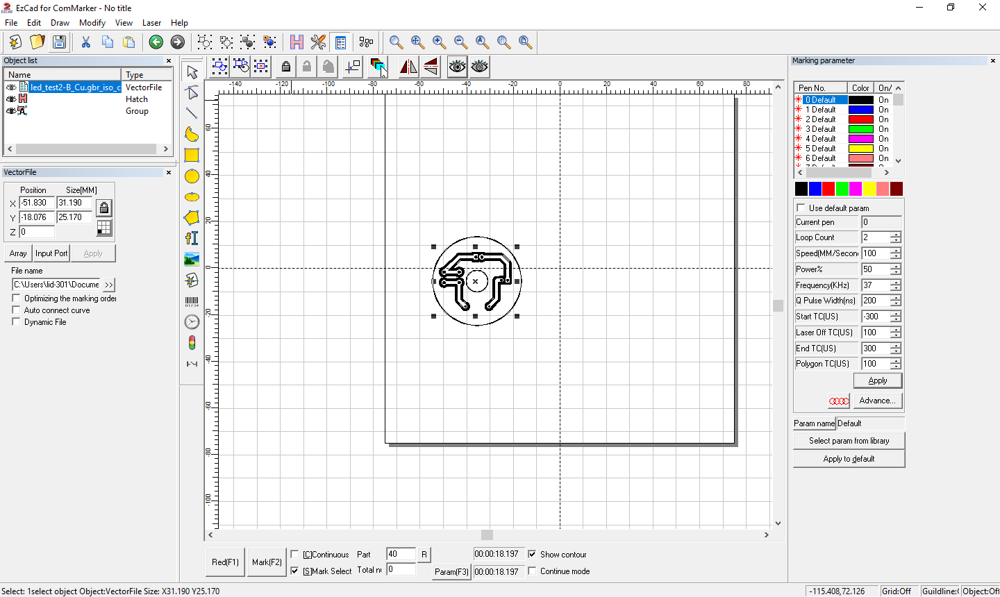
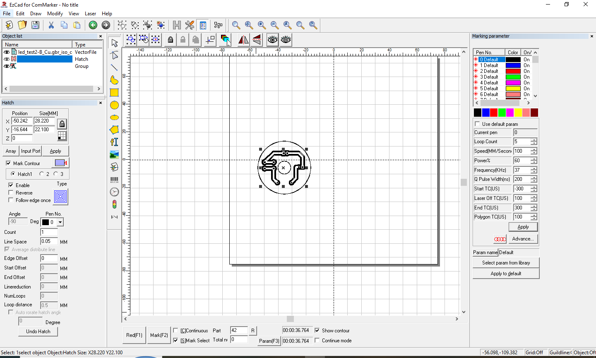
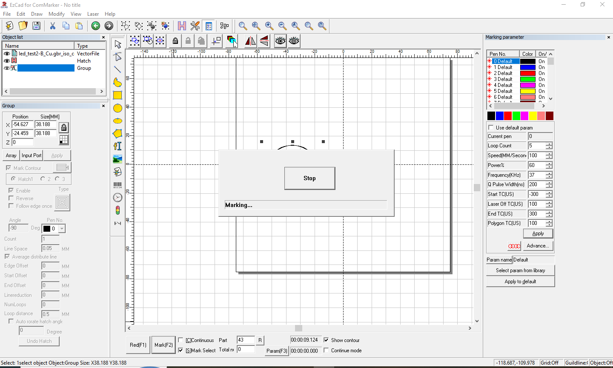
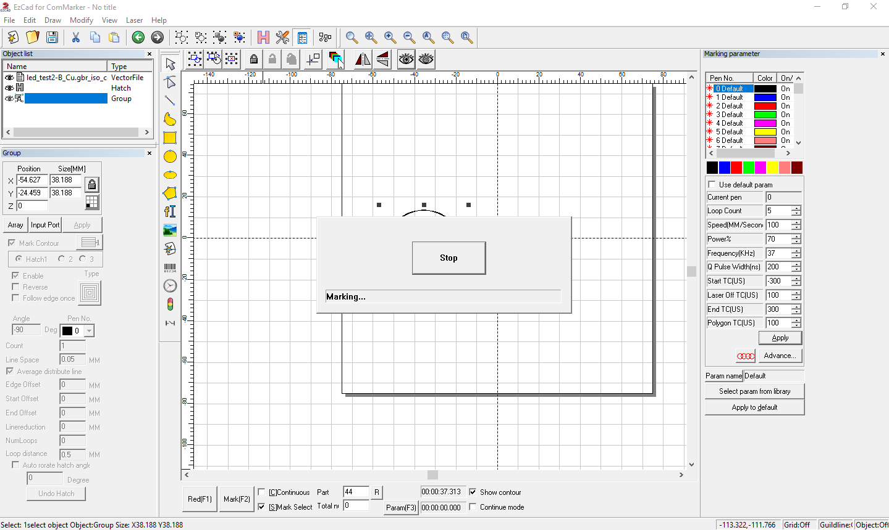
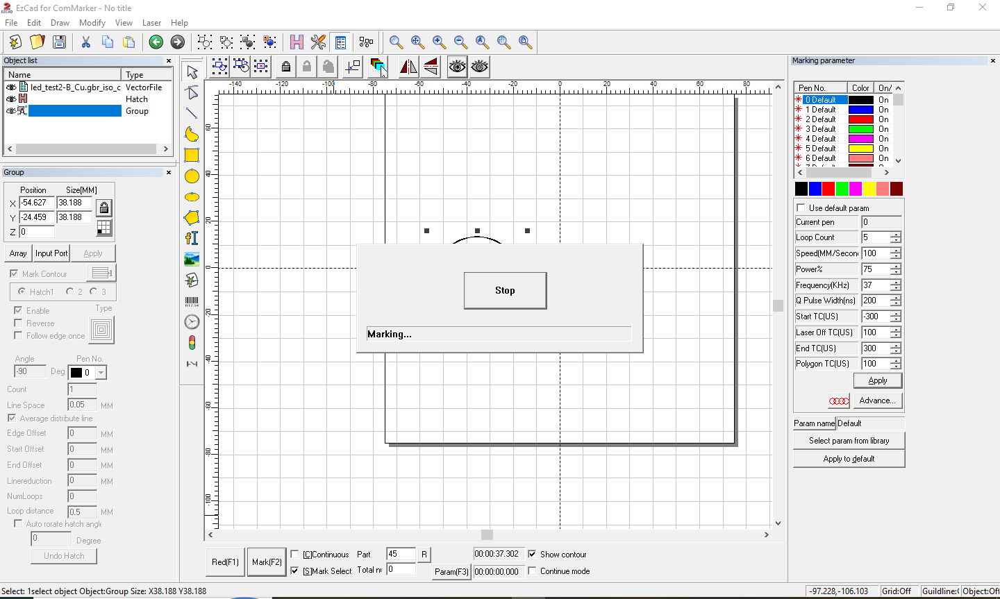

# 1. Video de demo del projecto

Link del video completo [LINK](https://drive.google.com/file/d/1_Y6Q92ba8wCWatpGXgBM9rO_ihdwnnQ7/view?usp=sharing)

https://github.com/user-attachments/assets/3c7f3636-a958-407d-bf8c-1eb1ea96cda6

## 1.1 Consideraciones adicionales
- Se agrandó los pads de la pcb
- Se agrandó el circulo del borde
- La potencia de la máquina fue entre 50%-75%, para evitar el quemado de la fibra de vidrio.

# 2. Pruebas para el corte de la PCB

## 2.1 Corte del cobre de la PCB
Se dio 2 veces la siguiente configuración:
| Parameter | Value |
| - | - |
| Loop Count | 2 |
| Speed(MM/Secon) | 100 |
| Power% | 50 |
| Frequency(KHz) | 37 |

##  2.2 Agujeros del taladro
Se dio 1 ves la siguiente configuración:
| Parameter | Value |
| - | - |
| Loop Count | 5 |
| Speed(MM/Secon) | 100 |
| Power% | 60 |
| Frequency(KHz) | 37 |

## 2.3 Corte del marco - se corrieron estas 3 configuraciones:

| Parameter | Value |
| - | - |
| Loop Count | 5 |
| Speed(MM/Secon) | 100 |
| Power% | 60 |
| Frequency(KHz) | 37 |

| Parameter | Value |
| - | - |
| Loop Count | 5 |
| Speed(MM/Secon) | 100 |
| Power% | 70 |
| Frequency(KHz) | 37 |

| Parameter | Value |
| - | - |
| Loop Count | 5 |
| Speed(MM/Secon) | 100 |
| Power% | 75 |
| Frequency(KHz) | 37 |

